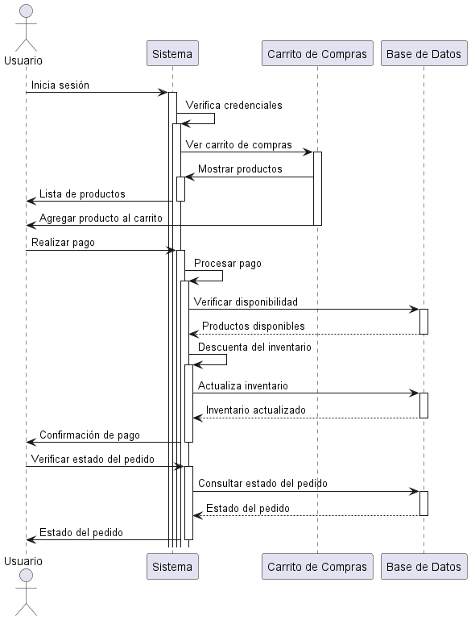

# Diagrama de Secuencia: Proceso de Compra en Línea

Este diagrama de secuencia representa el flujo de interacciones entre un usuario, un sistema de compras en línea, un carrito de compras y una base de datos durante el proceso de compra en línea.

El diagrama sigue los siguientes pasos:

1. **Inicio de Sesión:**
   - El usuario inicia sesión en el sistema.
   - El sistema verifica las credenciales del usuario.

2. **Ver Carrito de Compras:**
   - El sistema muestra al usuario los productos que tiene en su carrito de compras.

3. **Agregar Producto al Carrito:**
   - El usuario agrega un producto al carrito de compras.

4. **Realizar Pago:**
   - El usuario decide realizar el pago.
   - El sistema procesa el pago, verificando la disponibilidad de los productos en la base de datos.
   - La base de datos confirma la disponibilidad de los productos y el sistema descuenta los productos del inventario.
   - El sistema actualiza el inventario en la base de datos.

5. **Confirmación de Pago:**
   - El sistema confirma al usuario que el pago se ha realizado correctamente.

6. **Verificar Estado del Pedido:**
   - El usuario verifica el estado de su pedido.
   - El sistema consulta el estado del pedido en la base de datos.
   - La base de datos devuelve el estado del pedido al sistema.
   - El sistema muestra al usuario el estado de su pedido.




``` plantuml
@startuml Diagrama_secuencias
actor Usuario

participant "Sistema" as Sistema
participant "Carrito de Compras" as Carrito
participant "Base de Datos" as BD

Usuario -> Sistema: Inicia sesión
activate Sistema
Sistema -> Sistema: Verifica credenciales
activate Sistema
Sistema -> Carrito: Ver carrito de compras
activate Carrito
Carrito -> Sistema: Mostrar productos
activate Sistema
Sistema -> Usuario: Lista de productos
deactivate Sistema
Carrito -> Usuario: Agregar producto al carrito
deactivate Carrito

Usuario -> Sistema: Realizar pago
activate Sistema
Sistema -> Sistema: Procesar pago
activate Sistema
Sistema -> BD: Verificar disponibilidad
activate BD
BD --> Sistema: Productos disponibles
deactivate BD
Sistema -> Sistema: Descuenta del inventario
activate Sistema
Sistema -> BD: Actualiza inventario
activate BD
BD --> Sistema: Inventario actualizado
deactivate BD
Sistema -> Usuario: Confirmación de pago
deactivate Sistema

Usuario -> Sistema: Verificar estado del pedido
activate Sistema
Sistema -> BD: Consultar estado del pedido
activate BD
BD --> Sistema: Estado del pedido
deactivate BD
Sistema -> Usuario: Estado del pedido
deactivate Sistema

@enduml